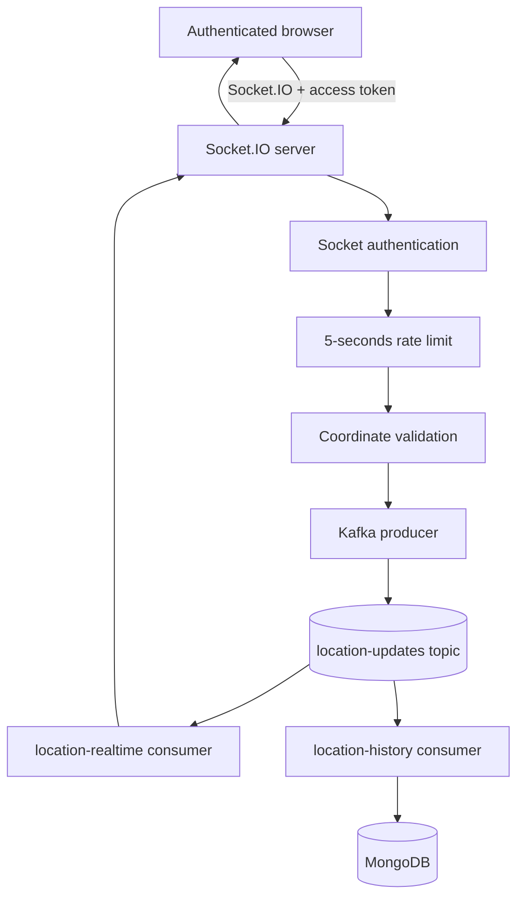
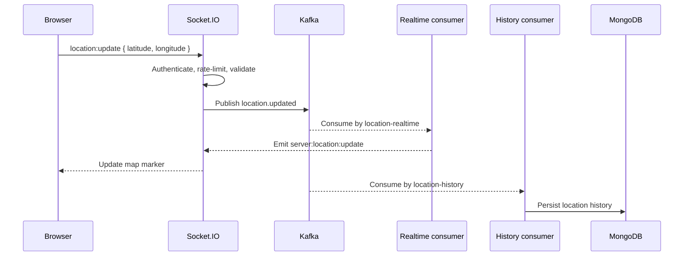
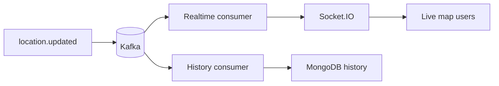

# LiveTrack

LiveTrack is a focused Kafka learning project for authenticated, real-time location sharing. A signed-in user shares browser coordinates through Socket.IO; the server validates and rate-limits each update, publishes it to Kafka, broadcasts it to connected clients, and independently stores it in MongoDB.

This is a modular monolith for learning and exploration. Kafka is the event boundary between receiving a location update and processing that update for different purposes.

## Features

- Registration with name, email, password, optional role, and email verification
- Sign-in with JWT access tokens and HTTP-only refresh-token cookies
- Password reset email and reset endpoint
- Protected profile lookup and logout
- Authenticated Socket.IO connections
- Browser Geolocation API with explicit Share and Stop controls
- Location updates every 10 seconds while sharing
- Latitude and longitude validation before publishing
- Three-second per-user in-memory rate limit
- Kafka topic for location events, keyed by user ID
- Independent realtime and history Kafka consumer groups
- Live Leaflet markers with user names and a distinct current-user marker
- MongoDB location history records
- Local MongoDB and Kafka infrastructure through Docker Compose

## Purpose and Scope

The project demonstrates:

- Kafka producers, topics, message keys, and consumer groups
- Independent event processing for realtime delivery and persistence
- Socket.IO integration with JWT authentication
- Server-side validation and rate limiting
- A modular-monolith structure instead of separately deployed services

It intentionally does not attempt to be a production tracking platform. It has no route history UI, geospatial analytics, geofencing, distributed rate limiter, Kafka cluster, or horizontally scaled Socket.IO adapter.

## Tech Stack

| Area | Technology |
| --- | --- |
| Runtime | Node.js with ES modules |
| HTTP API | Express 5 |
| Authentication | JWT, bcryptjs, Nodemailer |
| Realtime transport | Socket.IO |
| Event streaming | Apache Kafka through KafkaJS |
| Database | MongoDB through Mongoose |
| Frontend | HTML, CSS, and vanilla JavaScript |
| Map | Leaflet |
| Local infrastructure | Docker Compose |

## Architecture



The same event is consumed independently by two consumer groups. Realtime processing emits `server:location:update` through Socket.IO, while history processing stores `userId`, latitude, longitude, and timestamp in `LocationHistory` documents.

### Location Event

```json
{
  "eventType": "location.updated",
  "userId": "64f...",
  "username": "Example User",
  "latitude": 30.2016,
  "longitude": 71.508,
  "timestamp": "2026-08-25T07:38:10.390Z"
}
```

### Request Flow



## Project Structure

```text
kafka-live-location-tracker/
│
├── src/
│   ├── common/
│   │   ├── config/
│   │   │   ├── db.js
│   │   │   └── kafka.js
│   │   │
│   │   └── utils/
│   │       └── api-error.js
│   │
│   ├── modules/
│   │   ├── auth/
│   │   │   ├── auth.controller.js
│   │   │   ├── auth.routes.js
│   │   │   ├── auth.service.js
│   │   │   └── ...
│   │   │
│   │   └── location/
│   │       ├── dto/
│   │       │   └── location-update.dto.js
│   │       │
│   │       ├── kafka/
│   │       │   ├── consumers/
│   │       │   │   ├── realtime.consumer.js
│   │       │   │   └── history.consumer.js
│   │       │   │
│   │       │   ├── kafka.client.js
│   │       │   ├── producer.js
│   │       │   └── topic.js
│   │       │
│   │       ├── models/
│   │       │   └── location-history.model.js
│   │       │
│   │       ├── services/
│   │       │   └── location.service.js
│   │       │
│   │       └── sockets/
│   │           ├── location.socket.js
│   │           └── socket-auth.js
│   │
│   └── app.js
│   
├── public/
│   │
│   ├── css/
│   │   └── style.css
│   │
│   ├── js/
│   │   ├── app.js
│   │   └── auth.js
│   │
│   └─── index.html
│
├── docker-compose.yml
├── .env.example
├── .gitignore
├── package.json
├── package-lock.json
├── server.js
└── README.md
```

## Run Locally

### Prerequisites

- Node.js and npm
- Docker Desktop with Docker Compose
- An SMTP account or local SMTP provider for verification and reset emails

### Install and Configure

```bash
npm install
```

Copy `.env.example` to `.env` and set real values. Do not commit `.env`.

Important variables used by the application include:

```env
PORT=4000
NODE_ENV=development
MONGODB_URI=mongodb://localhost:27017/myauth
JWT_ACCESS_SECRET=replace-with-a-long-secret
JWT_REFRESH_SECRET=replace-with-a-long-secret
JWT_ACCESS_EXPIRES_IN=15m
JWT_REFRESH_EXPIRES_IN=7d
SMTP_HOST=localhost
SMTP_PORT=1025
SMTP_USER=
SMTP_PASS=
SMTP_FROM_NAME=LiveTrack
SMTP_FROM_EMAIL=noreply@example.com
CLIENT_URL=http://localhost:4000
KAFKA_PORT=9092
KAFKA_BROKER=localhost:9092
KAFKA_CLIENT_ID=live-location-tracker
KAFKA_LOCATION_TOPIC=location-updates
```

The exact SMTP values depend on the provider. `CLIENT_URL` is used to build email links and Socket.IO CORS settings. The Docker Compose file also reads MongoDB credentials and `MONGO_PORT` from `.env`; configure those when using the authenticated MongoDB URI shown in `.env.example`.

### Start Services

```bash
docker compose up -d
docker compose ps
npm run dev
```

Open [http://localhost:4000](http://localhost:4000). The server defaults to port `4000`; set `PORT` to use another port and keep `CLIENT_URL` aligned.

## Authentication API

Base URL: `http://localhost:4000/api/auth`

| Method | Path | Access | Purpose |
| --- | --- | --- | --- |
| POST | `/signup` | Public | Create an unverified account and send verification email |
| GET | `/verify-email/:token` | Public | Verify an email token; email links redirect back to the UI |
| POST | `/signin` | Public | Sign in after email verification |
| POST | `/logout` | Access token | Clear the refresh token |
| GET | `/me` | Access token | Return the current user |

Protected requests use:

```http
Authorization: Bearer <accessToken>
```

The integrated UI stores the access token in session storage and sends it when opening the Socket.IO connection. Signup and signin requests are handled by the same frontend screen as the tracker.

Note: For authentication i used [my-auth-js](https://github.com/maazhafeez698/my-auth-js)

## Location Behavior

1. The map starts centered on Pakistan.
2. The browser asks for location permission when Share is selected.
3. A valid location is sent through `location:update`.
4. The server rejects invalid coordinates or updates inside the three-second limit.
5. Accepted coordinates become a Kafka event.
6. The first valid own update recenters the map; later updates move the marker without constantly recentering it.
7. Center on Me performs a manual recenter.
8. Stop ends future location requests for that session.

## Testing and Verification

There is no automated test suite configured in `package.json`. 

For a manual check:

- Register, open the verification email, and confirm the UI returns to login.
- Sign in and allow browser location access.
- Select Share and confirm the own marker updates.
- Open a second authenticated browser session and verify realtime markers.
- Check MongoDB for `LocationHistory` documents.
- Send updates within three seconds and confirm the rapid update is rejected.

## Limitations

- The rate limiter is an in-memory map tied to one Node.js process.
- Kafka Compose is a single local broker with replication factor one.
- Socket.IO is not configured with a shared adapter for multiple server instances.
- Disconnected users' last markers can remain visible because there is no presence cleanup flow.
- Location history is persisted, but there is no history or route visualization in the UI.
- Browser geolocation depends on browser permissions, HTTPS requirements in some environments, and device accuracy.
- SMTP delivery is external and must be configured separately.
- This project is intended for local learning, not production deployment or sensitive real-world tracking without additional security and privacy controls.

## Learning Takeaway

LiveTrack publishes one validated `location.updated` event once and lets independent consumers use it for different purposes:



That producer/topic/consumer-group pattern is the central Kafka concept demonstrated by the project. Kafka is used as the event stream and processing boundary; MongoDB remains the application's persistent location-history store.

## License

Personal learning and exploratory project.
